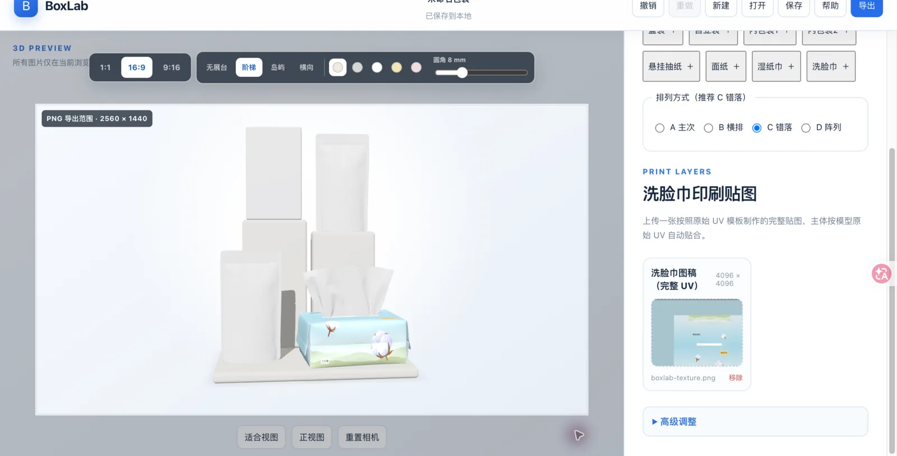
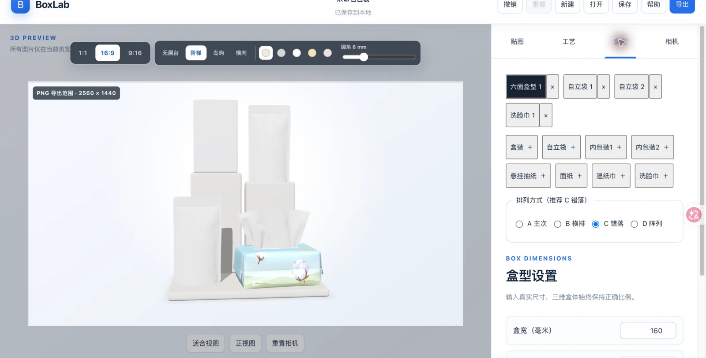
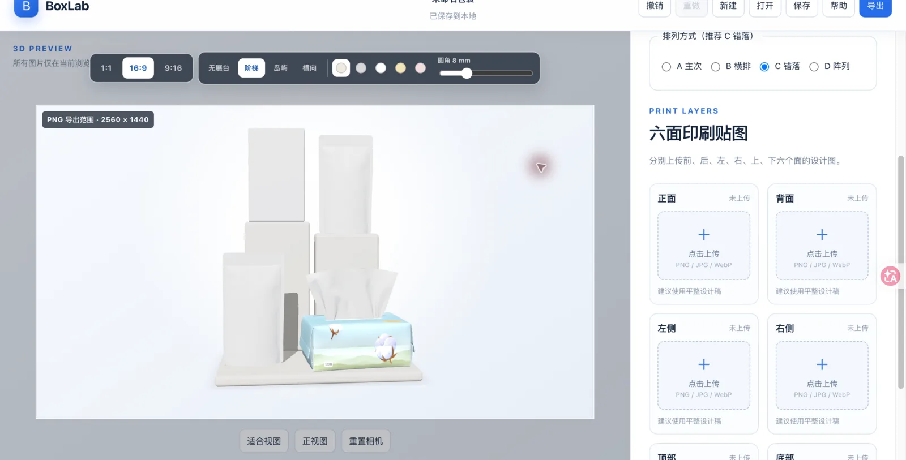
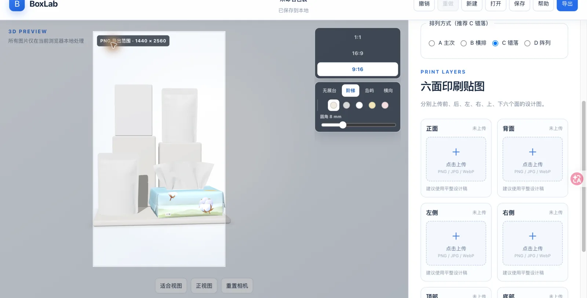

# 包装预览 Packaging Preview

包装预览是一款面向包装设计师的浏览器 3D 包装效果预览工具。它把平面设计稿映射到真实的包装结构上，让你在打样或反复导出渲染之前，快速检查不同角度下的贴图、尺寸、光照和表面工艺效果。

## 它解决什么问题

传统包装提案通常需要在 Photoshop、3D 软件和打样之间反复切换：改一处贴图就要重新渲染，盒装、自立袋、纸巾等不同结构也要分别处理。包装预览把这些检查集中到一个浏览器工具里，适合在设计评审、客户提案和打样前快速确认：

- 设计稿是否正确贴合包装的真实结构和多个面
- 尺寸、视角、光照变化后，整体效果是否仍然成立
- 烫金、银色、镭射、局部 UV、压凹凸等工艺蒙版的位置是否准确
- 是否需要在进入正式 3D 渲染或实物打样前先发现问题

## 大版本预览

本版本重点升级了多包装组合、真实尺寸安全排布、整体展台和可视化导出画幅。以下截图均来自本地运行中的真实界面，展示的是当前版本实际可用的状态。









在线预览：<https://packaging-preview.winstedlason269.chatgpt.site>

## 功能

- 支持 1–6 个独立包装实例；不同盒型、同一盒型的重复实例可以混合，每个实例拥有独立贴图、工艺、尺寸和模型状态
- 提供 A 主次、B 横排、C 错落、D 阵列四种组合排列；2 个默认 B，3–4 个默认 C，5–6 个默认 D，也可以随时手动切换
- 按真实宽度、深度和高度计算安全间距，避免模型穿插；新增或修改尺寸后自动重新排布、整体居中并调整相机
- 所有包装和展台共享落地平面，自动对齐最低点，组合中不会出现悬空包装
- 展台可关闭，也可选择阶梯、岛屿或横向形态；提供暖白、浅灰、白色、浅黄、浅粉五种颜色和 0–30 mm 圆角
- 导出画幅支持 1:1、16:9、9:16；预览中的白色取景框固定显示最终导出范围，工具栏位于灰色工作区，不遮挡画幅
- PNG 导出提供 800 px、3000 px 正方形和 2K 横竖画幅（2560 × 1440、1440 × 2560）
- 盒装支持前、后、左、右、上、下六面独立上传贴图
- 自立袋和内包装 2 支持正面、背面贴图；内包装 1 支持完整 UV 图稿
- 悬挂抽纸支持正、背、左、右四面贴图
- 盒装和自立袋拥有独立的工艺状态
- 支持烫金、银色、镭射、局部 UV、压凹凸五种可叠加工艺
- 支持相机旋转、缩放、自动旋转和全局棚拍光强控制
- 支持本地项目保存/加载和透明 PNG 导出
- 上传图片在当前浏览器本地处理，不会由应用发送到服务器

## 支持的包装类型

盒装、自立袋、内包装 1、内包装 2、悬挂抽纸、面纸和湿纸巾。

## 本地运行

环境要求：Node.js 20 或更高版本。

```bash
npm install
npm run dev
```

生产检查：

```bash
npm run typecheck
npm run lint
npm run test:run
npm run build
npm run test:sites
```

## 范围与隐私

这是一个 local-first 原型，不提供账号、云端项目存储、AI 识别、刀模拆分或自动面分配。设计稿只保存在当前浏览器内存或 IndexedDB 中，用于本地项目操作。

## 许可证

源代码和文档采用 [MIT License](LICENSE)。`public/models/` 下的模型和图片是本项目使用的输入素材，本仓库不声明其再分发或商业使用权；复用前请独立确认每项素材的授权范围。
